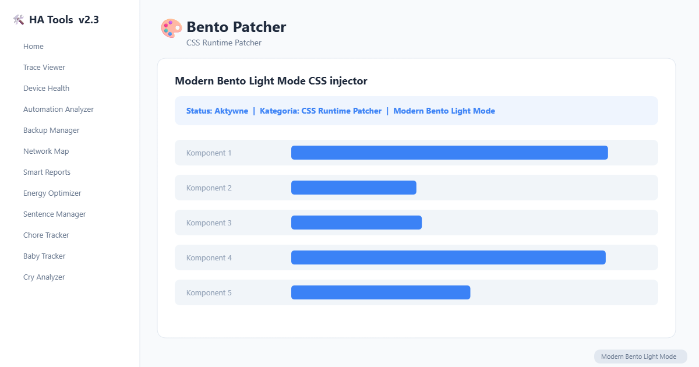

# HA Bento Patcher

Runtime CSS patcher that applies Modern Bento Light Mode design system to all HA Tools via Shadow DOM injection.

## Installation

### HACS (recommended)

1. Open HACS in Home Assistant
2. Go to **Frontend** section
3. Click the three dots menu > **Custom repositories**
4. Add `https://github.com/MacSiem/ha-bento-patcher` as **Dashboard**
5. Install **HA Bento Patcher**
6. Restart Home Assistant

### Manual

Copy the contents to `/config/www/community/ha-bento-patcher/`

## Design

Uses **Modern Bento Light Mode** design system:

- Background: `#F8FAFC`
- Primary: `#3B82F6`
- Text: `#1E293B`
- Border: `#E2E8F0`
- Font: Inter, 16px border-radius, smooth animations

## License

MIT
